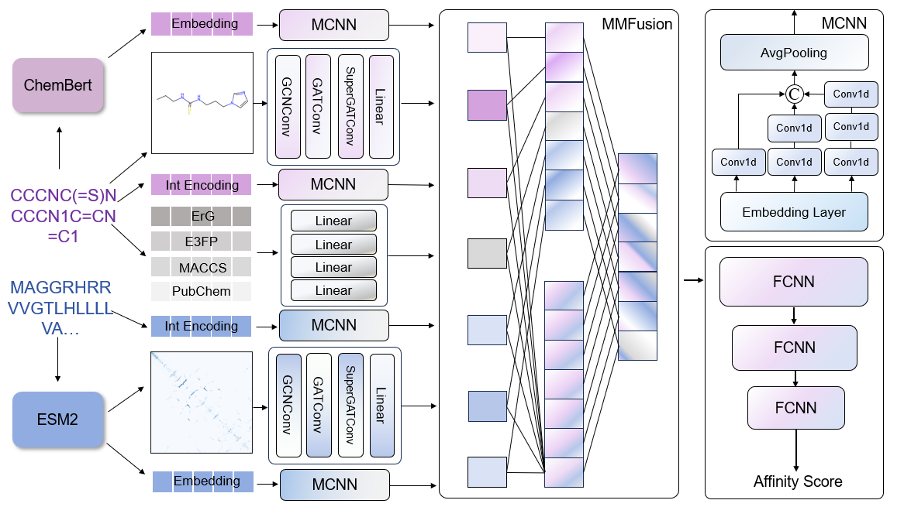

# E3MMDTA: Predicting Drug Target Affinity by Combining E3FP Fingerprints and Multimodal Fusion

A multimodal framework that integrates Extended 3-Dimensional FingerPrint(E3FP) with 2D graphs, sequence embeddings, and pretrained language model features.
